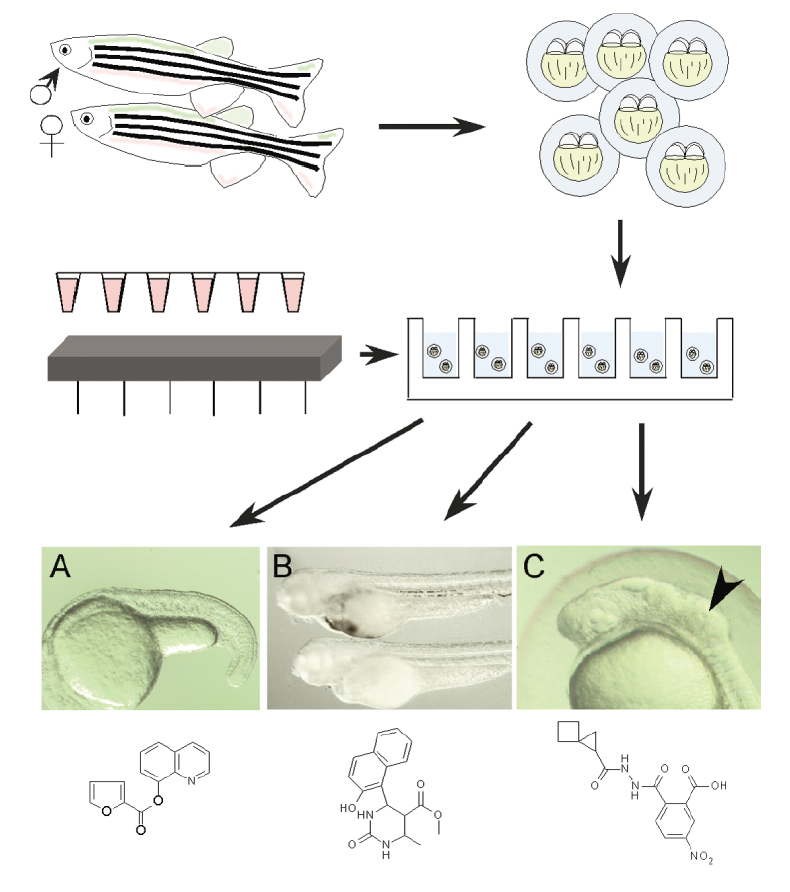

```{r setup, include=FALSE}
knitr::opts_chunk$set(echo = FALSE)
```

```{r, echo=FALSE, message=FALSE}
library(ROCR)
library(readr)
library(knitr)
library(dplyr)
library(tidyr)
library(stringr)
library(ggplot2)

# load data files
load("auc_scores.Rdata")
load("roc_results.Rdata")
```


#A machine learning approach to predict the toxic side effects of unknown drugs

##Summary
Phenotype-based screening of small molecules is the basis of modern drug discovery. However, hit rates from these screens are typically too low to permit identification of common chemical or structural themes among the identified compounds. Importantly, screening is done either in vitro using high-throughput phenotyping, or in model organisms that have either very limited relevance to vertebrate biology or are not amenable to automated phenotyping. Here, a small library of 4,182 bio reactive compounds was manually screened in live zebrafish recording over one thousand compound-phenotype associations spanning an array of 10 distinct developmental phenotypes. In this project we tested the hypothesis that a machine learning framework can predict phenotypes of unknown compounds based to their physical and structural properties. Furthermore, using independent screening data from human cancer cells we tested the idea that our model could help to predict the toxic side effects of unknown cancer drugs.  If successful, this method will be suitable for prioritizing much larger libraries (e.g. consisting of millions of compounds) for specific phenotypic classes that are relevant to human physiology. 

##Background and motivation
Unexpected toxic side effects are a major problem in drug development. Historical data show that nearly 90% of drug withdrawal cases were caused by severe toxic effects, among which the majority were associated with cardiovascular symptoms. As an example, in 2004, rofecoxib (Vioxx), Merck’s blockbuster anti-inflammatory drug was removed from the market because of increased risk of heart attack and stroke. As another example, propulsid (Cisapride), an oral drug to treat gastroesophageal reflux disease (GERD), was associated with over 400 adverse cardiac events (arrhythmias) resulting in more than 80 deaths in the USA. It was removed from the US market in 2000. Other well-known drugs that were withdrawn due to toxic effects include the antihistamine terfenadine and the antibacterial grepafloxacin. Considering an average development cost of almost $1.8 billion and approximately 8.5 years of effort to bring a new drug to market, late-stage withdrawals mean significant losses to the pharmaceutical industry. The high cost of failure is also an important cause for the continuous decline in the number of new drugs that have entered the market over the past 10 years. Therefore, new methods are needed that can identify serious adverse effects during early stage of drug development. 

##The zebrafish model for drug discovery
Zebrafish have several properties that make them ideal for physiology-based screens: they are small, inexpensive to maintain and easily bred in large numbers - a single pair of adult zebrafish will generate 100-200 offspring per week. Embryos are only 1-4 mm long and can live for up to seven days in a single well of a standard 96- or 386-well plate supported by nutrients stored in the yolk sac. Administration of drugs is simple: zebrafish embryos absorb small molecules diluted in the surrounding water through their skin and gills. Highly hydrophobic compounds, large molecules and proteins can be injected into the yolk sac or the circulation. Compared to testing in other animal models, statistically significant numbers of zebrafish can be used for each assay and small amounts (~mg) of drugs are required. Importantly, zebrafish embryos are transparent for several days post fertilization which allows in vivo observation of organ function. Zebrafish embryos grow rapidly, with the basic body plan laid out within 24 hours post-fertilization (h.p.f.). Hatching occurs normally at 48 - 72 h.p.f., and the majority of organs, including the nervous system, cardiovascular system, intestines, liver, pancreas, kidneys, bone and sensory organs are differentiated and functional at 3-5 days post fertilization. The organs of zebrafish have been shown to be very close to their mammalian counterparts at the anatomical, physiological and molecular levels. Drug-screening assays based on the zebrafish model can streamline the drug development time-line, prioritize drug candidates for mammalian testing and reduce cost. At the same time, these assays provide a wealth of information directly related to the integrated physiology of an intact organism. Since phenotypes observed during zebrafish development can have immediate relevance to processes higher vertebrate, drugs identified in phenotype-driven screens translate well to mammalian systems. Additionally, because zebrafish are an outbred model, they allow testing of compounds across multiple genetic backgrounds. However, despite these advantages, small molecule screens in zebrafish typically identify one or a small number of relevant compounds, not observing any systematic relationships between chemical structure and toxicity, or specific phenotypic classes.

##Data sets
###*Training set*
A data set for *training* and *cross-validation* was generated by observing the responses of developing zebrafish embryos to the bioactive small molecules in each well. In an effort  to associate a maximal number of chemical structures with consequent developmental phenotypes, we screened 4,182 bioactive small molecules. These compounds were selected as a subset of a commercial library consisting of over 900,000 compounds (ChemBridge corporation, CA) and used as the *training set* in this project. The *training set* compounds were selected due to their previously described activity in yeast, which suggested that they each had a target within the eucariotic cell, albeit an unknown one. After drug exposure, embryos were screened for a series of developmental phenotypes at 24 and 48 h.p.f. using standard light microscopy. At 24 h.p.f. a single observer examined each well for dead embryos or obvious developmental delay (see figure below). Only those wells where at least two of the three embryos were dead or delayed were annotated as a hit for 24 hour death or delay/arrest, respectively. If any of the 16 control wells had a 24 h.p.f. death or delay/arrest phenotype, the plate was discarded. At 48 h.p.f., two independent observers screened the plates, examining for 8 additional phenotypes including embryo death, developmental delay, pigmentation defects, multiple cardiac defects, jaw defects, cyclopia. Only wells where at least two of the three embryos presented with the same phenotype were taken as a hit for this phenotype. 
All phenotypes were screened as binary classes (hit / no hit) and labelled as P01, P02, .. , P10 in the data set.

<center></center>


##Screening for chemical modifiers of vertebrate development
Adult zebrafish lay hundreds of fertilized eggs each morning. Embryos are arrayed in assay 96-well plates and compounds from small molecule libraries are added to the water in each well. Embryos are allowed to develop and are screened visually for developmental defects. Examples of specific phenotypes include elongation of the notochord (A), absence of blood (B, untreated, upper; treated lower), and loss of a single otolith in the ear (C). 


```{r eval = TRUE, echo = FALSE, message = FALSE}
#Phenotypes in the data set
raw <- read_csv('yactives_training_set_2.csv')
#separate classes from features
dat_c <- select(raw, P1:P10)
names(dat_c) <- names(dat_c) %>% gsub('P','',.)
dat_f <- select(raw, -(ID:P10))

#sort class columns by hits
class_pos <- dat_c %>%
  summarize_each(funs(sum)) %>%
  gather(key = Phenotype, value = hits, `1`:`10`) %>%
  arrange(desc(hits))

#re-arrange phenotype classes by hits
dat_c <- select(dat_c, as.numeric(class_pos$Phenotype)) 

#add correct title to the phenotype column
class_pos <- class_pos  %>% 
  mutate(Phenotype = paste('P', sprintf("%02.0f", as.numeric(Phenotype)), sep = '')) 

#plot histogram of hits
p <- ggplot(data = class_pos, 
            aes(x = reorder(Phenotype, desc(hits)), y = hits, fill = Phenotype))
p +
  geom_bar(stat = 'identity') +
  theme(legend.position = 'none' ) +
  #theme(axis.ticks = element_blank(), axis.text.x = element_blank()) +
  xlab('Phenotype') + ylab('Number of hits') + 
  ggtitle('Phenopyte hits for all drugs')
```

Figure: Number of positive samples (hit) for the 10 observed zebrafish phenotypes P01, .. P10 in the *training set*.

###Independent *Test set*
In addition to the training set, we tested our algorithm using phenotypic data from a very different model system. We used publicly available small moecule screening data from the [Broad Institute's](http://www.broadinstitute.org/) Cancer Therapeutics Response Portal [CTRP](http://www.broadinstitute.org/ctrp/). The data sets contain phenotypic information from 545 compounds tested on 860 different human cancer cell lines.  

###*Compound selection and feature generation*
Compounds were annotated by [SMILES](https://en.wikipedia.org/wiki/Simplified_molecular-input_line-entry_system) (Simplified Molecular Input Line Entry System) sequences, a molecular specification in the form of a line notation for describing the structure of chemical species using short ASCII strings. SMILES strings were collected from the compound documentation files and converted into [Structure Data File (SDF)](https://en.wikipedia.org/wiki/Chemical_table_file) format which can be read by most chemical informatics programs using the open source software [Open Babel](http://openbabel.org/wiki/Main_Page). Further processing of the SDF files was done using the chemical tools *cxcalc* (to derive physical properties) and *generatemd* (to derive structural properties) from the compounds. These tools are components of the commercial chemical engineering software package [ChemAxon](https://www.chemaxon.com/) which required an academic license that we obtained from the manufacturer specifically for this class project. The physical properties were comprised of the number of rotatable bonds (RB), partition coefficient (logp), polar surface area (tPSA), number of hydrogen accaptors (Hacc), number of hydrogen donors (Hdon), and molecular weight (MW). To derive structural properties of the compounds, Extended-Connectivity Fingerprints [ECFPs](https://docs.chemaxon.com/display/docs/Chemical+Fingerprints+-+Home) were calculated using the ChemAxon software. These chemical descriptors are designed for molecular characterization, similarity searching, and structure-activity modeling. They are among the most popular similarity search tools in drug discovery and are effectively used in a wide variety of applications.

```{r eval = TRUE, echo = FALSE, message = FALSE}

#load the physical features of the training set
trainset_phys <- read_tsv('trainset_phys.txt') %>% mutate(SET = 'Trainset')
names(trainset_phys) <- c('ID', 'RB','logP','tPSA', 'Hacc', 'Hdon','MW', 'SET')

#load chemical fingerprint for the training set
trainset_ECFP <- read.table(
  file = 'trainset_ECFP.txt',
  header = FALSE, 
  skip = 2,
  sep = ' ',
  fill = TRUE)
names(trainset_ECFP) <- c('ID', 'ECFP')
trainset_ECFP <- bind_cols(select(trainset_phys, ID), select(trainset_ECFP, -ID))

#load the physical features of the test set
testset_phys <- read_tsv('testset_phys.txt') %>% mutate(SET = 'Testset')
names(testset_phys) <- names(trainset_phys)

#load chemical fingerprint for the test set
testset_ECFP <- read.table(
  file = 'testset_ECFP.txt',
  header = FALSE, 
  skip = 2,
  sep = ' ',
  fill = TRUE)
names(testset_ECFP) <- c('ID', 'ECFP')

#load the ID column for the test set
CTRP_compounds <- read_csv('v20.meta.per_compound.csv')
testset_ID <- data.frame(ID = CTRP_compounds$master_cpd_id)
testset_phys <- bind_cols(testset_ID, select(testset_phys, -ID)) 
testset_ECFP <- bind_cols(testset_ID, select(testset_ECFP, -ID))

#lets take a look at the same number of compounds from both sets
train_sample <- sample_n(trainset_phys, size = nrow(testset_phys), replace = FALSE)
dat <- bind_rows(testset_phys, train_sample)

#lets look at mass dependent on partition coefficient 
p <- ggplot(dat, aes(x = logP, y = MW, color = SET))
p +
  geom_point() +
  scale_colour_manual(values = c("blue","red")) +
  xlab('Partition coefficient (logP)') + ylab('Molecular weight (MW)') +
  guides(color=guide_legend(title=NULL))
  
```

Figure: Comparison of the physical properties of the compounds in the two data sets. Compounds shown as *Trainset* were randomly selected from the 4,182 zebrafish training data. Compounds shown as *Testset* were taken from the inependent cancer data set. This figure shows that the chemical properties of the compounds in the two data sets are quite different.

```{r eval = TRUE, echo = FALSE, message = FALSE}
#Function to exctract all ECFPs from the long list of strings

ECFP_list <- function(dataset) {
  #Get a list of unique ECFPs in the training set
  ECFP_char <- as.character(dataset$ECFP)
  #enter all ECFPs into one giant list
  ECFP <- as.numeric(str_split(ECFP_char[1], '\t')[[1]])
  #remember the number of ECFPs for each row
  ECFP_n <- length(ECFP)

  #collect ECFPs for all subsequent rows in the data
  for (i in 2:length(ECFP_char)) {
    ECFP_new <- as.numeric(str_split(ECFP_char[i], '\t')[[1]])
    ECFP <- append(ECFP, ECFP_new)
    ECFP_n <- append(ECFP_n, length(ECFP_new))
  }
return(list(ECFP = ECFP, N = ECFP_n))
}

```


```{r eval = TRUE, echo = FALSE, message = FALSE}
#Extract all ECFPs from the training data set
ECFP <- ECFP_list(trainset_ECFP)$ECFP

#generate list of unique ECFPs in the training set
ECFP_unique <- unique(ECFP) #all unique ECFPs
ECFP_number <- length(ECFP_unique) #number of unique ECFPs
ECFP_unique <- data.frame(ECFP = ECFP_unique) %>%
  mutate(ID = seq(1, ECFP_number, 1))

#find the unique ECFP IDs in the list of all ECFPs
#WARNING: this can take a while on a slow computer
ECFP_ID <- ECFP_unique$ID[which(ECFP_unique$ECFP %in% ECFP[1])]
for (i in seq(2, length(ECFP))) {
  ECFP_new <- ECFP_unique$ID[which(ECFP_unique$ECFP %in% ECFP[i])]
  ECFP_ID <- append(ECFP_ID, ECFP_new)
}

ECFP_FP_train <- data.frame(ECFP, FP = ECFP_ID)

#figure out the frequencies
tab_train <- as.data.frame(table(ECFP_FP_train$FP)) %>%
  arrange(desc(Freq)) %>% mutate(SET = 'Trainset') %>% mutate(NUM = seq(1, n(), 1))
names(tab_train) <- c('ECFP_ID','Frequency', 'SET', 'NUM')

```


```{r eval = TRUE, echo = FALSE, message = FALSE}
#Extract all ECFPs from the test data set
ECFP <- ECFP_list(testset_ECFP)$ECFP

found <- sum(ECFP_unique$ECFP %in% ECFP[1])
#if the ECFP is found in the list, a number > 0 is returned
ECFP_match <- ifelse(
  found > 0, ECFP_unique$ID[which(ECFP_unique$ECFP %in% ECFP[1])], 0)

#find the training ECFPs in the testset
for (i in seq(2, length(ECFP), 1)){
  #for each new ECFP, check if this one is in the list of trainins ECFPs
  found <- sum(ECFP_unique$ECFP %in% ECFP[i])
  #if the ECFP is found in the list, a number > 0 is returned
  ECFP_match <- append(ECFP_match, ifelse(
    found > 0, ECFP_unique$ID[which(ECFP_unique$ECFP %in% ECFP[i])], 0))
}


ECFP_FP_test <- data.frame(ECFP, FP = ECFP_match)

#figure out the frequencies
tab_test <- data.frame(table(ECFP_FP_test$FP)) %>%
  arrange(desc(Freq)) %>% mutate(SET = 'Testset') %>% mutate(NUM = seq(1, n(), 1))
names(tab_test) <- c('ECFP_ID','Frequency', 'SET', 'NUM')

#add percent frequencies
tab_test <- tab_test %>%
  mutate(Frequency_rel = Frequency/nrow(ECFP_FP_test) * 100) %>%
  mutate(ECFP_ID = as.numeric(as.character(ECFP_ID)))

tab_train <- tab_train %>%
  mutate(Frequency_rel = Frequency/nrow(ECFP_FP_train) * 100) %>%
  mutate(ECFP_ID = as.numeric(as.character(ECFP_ID)))

#combine the frequncy tables
tab <- bind_rows(tab_train,tab_test)

```


```{r eval = TRUE, echo = FALSE, message = FALSE}
#Plot frequencies of training ECFPs
#filter the number of ECFPs shown
tab_plot <- filter(tab, Frequency > 20 & ECFP_ID > 0)
tab_plot$SET_2 = factor(tab_plot$SET, levels=c('Trainset','Testset'))

p <- ggplot(data = tab_plot, aes(x = NUM, y = Frequency_rel))

p +
  geom_bar(stat = 'identity', color = 'red') +
  ggtitle('ECFP frequencies in the zebrafish data sets') +
  xlab('ECFP') + ylab('Frequency') +
  facet_grid(.~ SET_2, scales = 'free_y')
```

Figure: Comparison of the structural properties of the compounds in the two data sets represented by ECFPs. Each ECFP in the independent test set was matched with the corresponding feature in the trainig set to ensure that training and testing are done with the same set of features. A large number of unique ECFPs in the training set could be matched with the features in the testset, although the test set contained a significant number of ECFPs that could not be matched. This is consistent with the figure above suggesting that the compounds in the testset were very differerent from those in the training set.

```{r}
#get the number of matched ECFPs
matched <- 
  sum(filter(tab_test, ECFP_ID > 0)$Frequency)/sum(tab_test$Frequency) * 100
unmatched <- 
  sum(filter(tab_test, ECFP_ID == 0)$Frequency)/sum(tab_test$Frequency) * 100

match <- data.frame(
  Match = c(matched, unmatched), cat = as.factor(c('matched','unmatched')))

#plot the ECFP match
p <- ggplot(data = match, aes(x = cat, y = Match))

p +
  geom_bar(stat = 'identity', fill = 'red') +
  ggtitle('Proportion of matched ECFPs') +
  ylab('Frequency') + xlab('')

```

Figure: This graph shows the proportions of ECFPs in the test set that were successfully matched to the ECFPs in the training set. This data shows that almost 30% of the structural features in the test set are different from those in the trainig set which confirms that the compounds in the test set are very different from the compounds in the training set

##Results from the machine learning application
###ROC and Precision Recall Plots
###*AUC Summary*
The following table summarises the ROC AUC score for each phenotype prediction made by the random forest machine learning algorithm. The P2, P7, and P8 phenotypes are "death" indicators which inicate that the zebra fish died.  Death indicators P7 and P8 had the highest 2 AUC scores and P2 was 5th highest.

###*ROC AUC Scores For Each Phenotype Sorted by AUC Score*
```{r, echo=FALSE, message=FALSE}
# create an AUC score table
kable(arrange(auc_scores, desc(auc_scores)))
```

Phenotypes P11, P12, P13, and P14 were created as a logical "OR" from permutations of P2, P7, and P8 death indicators.  These derived death indicators also had high AUC scores as compared to other phenotypes.  In summary, 7 of the top 8 AUC scores were death indicators.  P4 was the only indicator in the top 8 that was not a death indicator.  The following table summarises the derived death indicators.

###*Derived Death Phenotype Indicator Table*
Derived Death Indicator Phenotype | Logical Operation
----------------------------------|------------------
P11                               | P2 OR P7 OR P8
P12                               | P2 OR P7
P13                               | P2 OR P8
P14                               | P7 OR P8

## ROC Curves
The following plot shows the ROC curves for the death phenotypes.  The curves show that the random forest prediction model does a reasonable job of predicting the death indicators from chemical fingerprints in the training data.

```{r, echo=FALSE, message=FALSE}
# plot combined ROC curves for death phenotypes
p2_roc <- performance(prediction.obj = roc_results$P2, 
                      measure = "tpr", x.measure = "fpr")
p7_roc <- performance(prediction.obj = roc_results$P7, 
                      measure = "tpr", x.measure = "fpr")
p8_roc <- performance(prediction.obj = roc_results$P8, 
                      measure = "tpr", x.measure = "fpr")
p11_roc <- performance(prediction.obj = roc_results$P11, 
                      measure = "tpr", x.measure = "fpr")
p12_roc <- performance(prediction.obj = roc_results$P12, 
                      measure = "tpr", x.measure = "fpr")
p13_roc <- performance(prediction.obj = roc_results$P13, 
                      measure = "tpr", x.measure = "fpr")
p14_roc <- performance(prediction.obj = roc_results$P14, 
                      measure = "tpr", x.measure = "fpr")

plot(p2_roc, col = "red", main = "ROC Curves For Death Indicator Phenotypes")
plot(p7_roc, col = "blue", add = TRUE)
plot(p8_roc, col = "green", add = TRUE)
plot(p11_roc, col = "black", add = TRUE)
plot(p12_roc, col = "purple", add = TRUE)
plot(p13_roc, col = "yellow", add = TRUE)
plot(p14_roc, col = "brown", add = TRUE)
legend('bottomright', c("P2", "P7", "P8", "P11", "P12", "P13", "P14"),
       lty = c(1, 1, 1, 1, 1, 1, 1), 
       lwd = c(2.5, 2.5, 2.5, 2.5, 2.5, 2.5, 2.5),
       col = c("red", "blue", "green", "black", "purple", "yellow", "brown"))
```

## Precision Recall Curves
The following curves show the precision recall curves for death indicator phenotypes.

```{r, echo=FALSE, message=FALSE}
# precision recall plot for death phenotypes
p2_pr <- performance(prediction.obj = roc_results$P2, 
                      measure = "prec", x.measure = "rec")
p7_pr <- performance(prediction.obj = roc_results$P7, 
                      measure = "prec", x.measure = "rec")
p8_pr <- performance(prediction.obj = roc_results$P8, 
                      measure = "prec", x.measure = "rec")
p11_pr <- performance(prediction.obj = roc_results$P11, 
                      measure = "prec", x.measure = "rec")
p12_pr <- performance(prediction.obj = roc_results$P12, 
                      measure = "prec", x.measure = "rec")
p13_pr <- performance(prediction.obj = roc_results$P13, 
                      measure = "prec", x.measure = "rec")
p14_pr <- performance(prediction.obj = roc_results$P14, 
                      measure = "prec", x.measure = "rec")
plot(p2_pr, col = "red", 
     main = "Precision Recall Curves for Death Indicator Phenotypes")
plot(p7_pr, col = "blue", add = TRUE)
plot(p8_pr, col = "green", add = TRUE)
plot(p11_pr, col = "black", add = TRUE)
plot(p12_pr, col = "purple", add = TRUE)
plot(p13_pr, col = "yellow", add = TRUE)
plot(p14_pr, col = "brown", add = TRUE)
legend('topright', c("P2", "P7", "P8", "P11", "P12", "P13", "P14"),
       lty = c(1, 1, 1, 1, 1, 1, 1), 
       lwd = c(2.5, 2.5, 2.5, 2.5, 2.5, 2.5, 2.5),
       col = c("red", "blue", "green", "black", "purple", "yellow", "brown"))
```

# Software Description  

## Table of Files Describing Each File In the Repository
```{r}
# create file name descriptions
auc_scores_desc <- 
  "R data file containing AUC Scores produced by the random forest model for each phenotype in the training data set"
CTRPv2_test_set_desc <- "Cancer drug independent data set for the random forest model"
drug_screening_R_desc <- "R application that performs machine learning analysis"
drug_screening_Rmd_desc <- "R markdown file which presents overall project analysis and results"
drug_screening_html_desc <- "The knitted output from drug-screening.Rmd"
predictions_desc <- "Independent test set prediction data produced by the random forest model"
roc_results_desc <- "R data file containing test data ROC prediction objects produced by the random forest model"
yactives_train_desc <- "Training data set for the random forest model"
v20.data_desc <- "Data downloaded from the Cancer Therapeutics Portal including compound IDs and their EC50 experimentation results with a variety of cancer cell lines. The predicted toxic effects of these compounds are summarized in predictions.csv"
v20.meta_desc <- "Data downloaded from the Cancer Therapeutics Portal including cancer cell lines, which is joined to the EC50 data set"
screening_jpg_desc <- "Support picture explaining the zebra fish test model"
trainset_phys_desc <- "Physical properties of the 4,182 compounds in the training set consisting of (1) number of rotatable bonds RB, (2) partition coefficient logP, (3) polar surface area tPSA, (4) number of hydrogen acceptors Hacc, number of hydrogen donors Hdon, molecular mass MW. This file was generated by cxcalc (ChemAxon LLC, Cambridge, USA)."
testset_phys_desc <- "Physical properties of the 545 compounds in the independent test set. This file was generated by cxcalc (ChemAxon LLC, Cambridge, USA)"
trainset_ECFP_desc <- "Structural properties of the 4,182 compounds in the training set as Extended Connectivity Fingerprints (ECFPs). This file was generated by generatemd (ChemAxon LLC, Cambridge, USA)"
Testset_ECFP_desc <- "Structural properties of the 545 compounds in the independent test set as ECFPs. This file was generated by generatemd (ChemAxon LLC, Cambridge, USA)"

files_df <- data.frame(File = c("auc_scores.Rdata", "CTRPv2_test_set.csv",
                                "drug-screening.R", "drug-screening.Rmd",
                                "drug-screening.html",
                                "predictions.csv", "roc_results.Rdata",
                                "yactives_training_set_2.csv", 
                                "v20.data.curves_post_qc.gz",
                                "v20.meta.per_experiment.txt",
                                "Screening.jpg",
                                "trainset_phys.txt",
                                "testset_phys.txt",
                                "testset_phys.txt",
                                "Testset_ECFP.txt"),
                       Description = c(auc_scores_desc, CTRPv2_test_set_desc,
                                       drug_screening_R_desc, 
                                       drug_screening_Rmd_desc,
                                       drug_screening_html_desc,
                                       predictions_desc,
                                       roc_results_desc,
                                       yactives_train_desc,
                                       v20.data_desc,
                                       v20.data_desc,
                                       screening_jpg_desc,
                                       trainset_phys_desc,
                                       testset_phys_desc,
                                       trainset_ECFP_desc,
                                       Testset_ECFP_desc))

kable(files_df)
```

## The Machine Learning Application: drug_screening.R
The drug-screening.R file contains the main R application that performs the machine learning analysis and saves data for analysis.  We chose to use a .R file as opposed to a .Rmd file because the RStudio debugger is much easier to use in a .R application than in a .Rmd file.  The drug-screening.R application reads the yactives_training_set_2.csv training set data and the CTRPv2_test_set.csv independent test set data.  Training and test data sets are created, and then each machine learning model is processed.  

The application was written such that it's very easy to add new machine learning models.  However, given the short duration of the project, the Random Forest model is currently the only model we have working.  Each model can be enabled or disabled individually using Boolean flags.  For example, the "knn_enabled" flag is set to false to disable the KNN model.  In addition, there is a "small_yactives_test_data_enabled" flag which is used to select a single phenotype which cuts the total runtime from approximately 4 hours to 20 minutes.  

The drug-screening.R application saves 4 files for analysis: model_results_list.Rdata, auc_scores.Rdata, roc_results.Rdata, and predictions.csv.  The model_results_list.Rdata file is a list containing all the random forest model results.  We did not include this file in our repository because it is approximately 371 mega-bytes in size and was too big to commit to the repository.  The 3 files that follow were created by extracting data from the model_results_list.Rdata object.  The data extracted were saved to separate files that were small enough to commit to the repository.  The auc_scores.Rdata file contains ROC AUC scores for each phenotype class.  The roc_results.Rdata file contains ROC objects which can be used to plot ROC and precision recall curves for each phenotype class.  The predictions.csv file contains the final random forest model predictions for the independent test set and was used to predict compounds efficacy on cancer cells.

##Prediction of Compounds Efficacy on Cancer Cells

The machine learning model generated and verified using the zebra fish model is used to predict drug efficacy on cancer cells. Although multiple phenotypes of zebra fish were used to generate the model, to simplify the study, only life/death is assessed for the cancer cells. Efficacy of compounds in killing cancer cells was predicted, the predicted data were evaluated by comparing to true experimental data showing efficacy, reflected by EC50, which is the amount of drug needed to kill half of the cells.
        The "Predictions.csv" file summarised predicted probability of compounds being efficacious on causing several phenotypes of cancer cells and their impact on cancer cell viability. Because the majority of the probability numbers are very small (smaller than 0.5), to choose the best response to work with, the number of positive indicators were compared among those phenotypes. We determined that P11.true, which is the probability of the compounds being able to kill cancer cells, will be the predicted data to be compared with true experimental data. This will show whether the prediction model generated using the zebra fish model could be used on mammalian cells. 
        The cancer cell viability data are downloaded from
ftp://caftpd.nci.nih.gov/pub/dcc_ctd2/Broad/CTRPv2.0_2015_ctd2_ExpandedDataset/CTRPv2.0_2015_ctd2_ExpandedDataset.zip. The txt file: v20.data.curves_post_qc.txt has the EC50 values of each compound used in this study (apparent_ec50_umol). The EC50 values are later converted to arbitrary efficacy values for each compound. The experiment id (experiment_id) column has the information that later was related to the cell lines. File v20.meta.per_experiment.txt has the cell line id (master_ccl_id) that are later joined to the data.  
        
The viability data used is "v20.data.curves_post_qc.gz" which contains the information of the experiment, compounds ID and their EC50 values in micro molar. The data has been cleaned to select four columns that will be needed: experiment_id, ec50, pred_pv_high_conc and ID. Those columns contain information of experiments (which is related to cell lines later), compounds (used to merge with prediction data) and EC50 values of the compounds. 

```{r, echo=FALSE, message=FALSE}
viability <- read.table(gzfile('v20.data.curves_post_qc.gz'), header = TRUE)

library(dplyr)
viability_ec50 <- select(viability, experiment_id, apparent_ec50_umol, pred_pv_high_conc, master_cpd_id)
colnames(viability_ec50) <- c('experiment_id', 'ec50','pred_pv_high_conc', 'ID')
```

The prediction data of the efficacy of the compounds using the zebra fish model is "predictions.csv", in which the efficacy of the drugs is reflected by probability values under column names "Px.true" where x is numbers 1-14 representing the prediction on different responses.
```{r, echo=FALSE, message=FALSE}
predicted <- read.csv("predictions.csv") %>% select(-X)
```

As mentioned before, the viability data and the prediction are joined by the compound ID so that we can compare the predicted data and the experimental data. A glimpse of the joined data is shown below:
```{r, echo=FALSE, message=FALSE}
accuracy <- left_join(predicted, viability_ec50, by = 'ID') 
accuracy %>% head(6)
```

The following plot shows the distribution of EC50 in log10 scale. The majority of the numbers are around 0. The data has a wide range within plus minus 300. 
```{r, echo=FALSE, message=FALSE}
hist(log10(accuracy$ec50), xlab = "log10_EC50 (umol)", ylab = "Frequency", main = "Distribution of EC50")
```

Correlation between predicted efficacy and measured efficacy reflected by converted EC50. The rationale is the lower the EC50 is, the more potent the drug potentially is. Therefore, EC50 is converted to some arbitrary number to be correlated with the predicted probability values in the prediction data set.The correlation between the true efficacy values and the predicted probability of efficacy is calculated.
```{r, echo=FALSE, message=FALSE}
true <- 1 - (log10(accuracy$ec50 + 10^(-30)) + 25)/50
true[true < 0.3] <- 0.3
true <- (true - 0.4)/0.6/0.8 
true[true < 0] <- 0
true[true >1] <- 1

## calculate the correlation
cor(true, accuracy$P11.true)
```

The value of correlation coefficient shows that there's no correlation between the predicted probability values and the converted EC50 values. 
        Indeed, if we take a look at the predicted value, only 5% of the total are positive predictions (P > 0.6), that has caused the evaluation of the predictions difficult and the result might not be representative. 
        
The prediction is further evaluated by comparing the distribution of the log 10 scaled EC50 values of compounds that have been predicted to show positive results to the distribution shown before for all EC50 values:
```{r, echo=FALSE, message=FALSE}
hist(log10(accuracy[which(accuracy$P11.true > 0.6),]$ec50), xlab = "log10_EC50 (umol)", ylab = "Frequency", main = "Distribution of EC50")
```

No big change in the distribution was observed.This indicates the drugs that are predicted to be effective are not distinguished from the others regarding to their EC50 values. That means EC50 and the predicted efficacy might not be related. 

Now we are computing the percentage of predicted values that matches the true experimental data. Arbitrary threshold is set to differentiate efficacious compounds from others based on the EC50 (if log10EC50 is smaller than 0, the compound is efficacious). Similarly, for the prediction data, a threshold of 0.6 for probability is set. Probability above 0.6 means the compound is predicted to be efficacious. The percentage of predictions matching true efficacy derived from EC50 is computed:
```{r, echo=FALSE, message=FALSE}
## threshold: EC50 < 1 is efficacious
efficacy <- log10(accuracy$ec50)
efficacy[efficacy < -1] <- 1
efficacy[efficacy != 1] <- 0

##threshold: p > 0.6 is efficacious
p11 <- accuracy$P11.true > 0.6

##percentage of predictions match true efficacy derived from EC50
mean(efficacy == p11)
```

The high percentage value is mainly due to the fact that only a small portion of the predicted values indicate a positive effect. Therefore, with a threshold that makes the experimental data saying "FALSE", most of the predicted values will match the experimental data.

Next, we are trying to see whether the prediction performs differently on different types of cells. The different cells are differentiated by cell line IDs. The cancer cell line information is joined to the current dataset by the experiment ID column.
```{r, echo=FALSE, message=FALSE}
## cancer cell line
cancer_cell <- read.table("v20.meta.per_experiment.txt", header = TRUE) %>% select(experiment_id, master_ccl_id)
accuracy <- left_join(accuracy, cancer_cell, by = "experiment_id") %>% select(ID, P11.true, ec50, master_ccl_id)
accuracy <- mutate(accuracy, Neg_log10_EC50 = -log10(ec50)) 
accuracy <- accuracy[-which(accuracy$ec50 == 0),]
corr <- accuracy %>% group_by(master_ccl_id) %>% summarise(cor(P11.true, Neg_log10_EC50))
colnames(corr) <- c("master_ccl_id", "corr")

##threshold
accuracy1 <- mutate(accuracy, pred = P11.true > 0.6, true = Neg_log10_EC50 > 10)
accuracy1 <- mutate(accuracy1, v = (pred == true))
score <- accuracy1 %>% group_by(master_ccl_id) %>% summarise(mean(v), n())
colnames(score) <- c('master_ccl_id', 'score', 'n')
```

Scores of the prediction is evaluated. The scores are calculated as the percentage of the predicted data that matches the experimentally predicted efficacy.

The scores are ploted for each cell line:
```{r, echo=FALSE, message=FALSE}
library(ggplot2)
score <- score[-which(score$master_ccl_id > 1000),]
p <- ggplot(score) + aes(x = master_ccl_id, y = score) + geom_point() + labs(title = 'Accuracy Score', x = 'Cell line ID', y = 'Score')
p
```

There are some variations in the prediction model's performance on predicting the compounds' efficacy on different cancer cell lines. However, again, this is not very representative since artifacts could be brought in when majority of the predictions are negative for the cancer cells. For example, when a cancer cell line has more predictions being false, then by tuning the threshold of EC50 and making the experimental data telling more inefficaccy of the compounds, the prediction could match the experimental data better. 

Plot the distance between the cell lines:
```{r, echo=FALSE, message=FALSE}
score <- score[-which(score$n < 600),]
X <- as.matrix(score$score)
rownames(X) <- score$master_ccl_id
d <- dist(X)
heatmap(as.matrix(d))
```
Using the strategy for calculating the prediction score, some cell lines show similarity among each other regarding the prediction accuracy using the zebra fish model. 

In conclusion, the assessment of the prediction model derived from zebra fish data on cancer cell data does not has good feasibility because the prediction model only predicted very small portion of the compounds in the cancer cell data set to be effective. This could be due to that the compounds that are studied in the cancer cells are not detrimental to the zebra fish (cancer cells are a completely different species from zebra fish anyway). The other reason could be the model was established on thousands of compounds but the cancer cell data only has < 500 compounds to work with. In addition,  the prediction of compounds' efficacy on cancer cells was using a relatively smaller number of features for simplicity, that could have reduced the prediction accuracy.

In fact, even if the predicted efficacy data showed good balance between positive and negative values, the model could just not work on the cancer cells. From biology understanding, zebra fish and cancer cells are too different from each other in terms of phenotypes and tolerance to the compounds. There is a high chance that the phenomena observed from zebra fish won't translate to mammalian cell lines.

However, one potential drawback of the current project is that we are only looking at life/death of the cancer cells. There could be other phenotypes of the cells that were able to be predicted using the zebra fish model. Given the short amound of time for the project, we did not have a chance to evaluate other possibilities but this could be something to explore further into.
